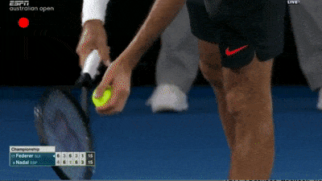

# Applying Computer Vision to Tennis

## Why?

Why not?

## What does it do?

Right now, it can detect when the full court is in view.

## What's next?

I'll work on estimating camera position to get an accurate
mapping of court boundaries within the video to actual court
boundaries, track player position and generate heatmaps.

## Demo

Notice the red circle in the top left corner turning green when
the full court is visible.

